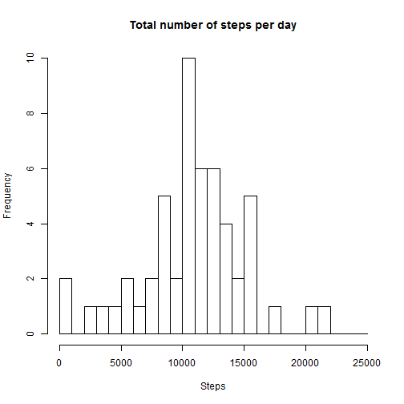
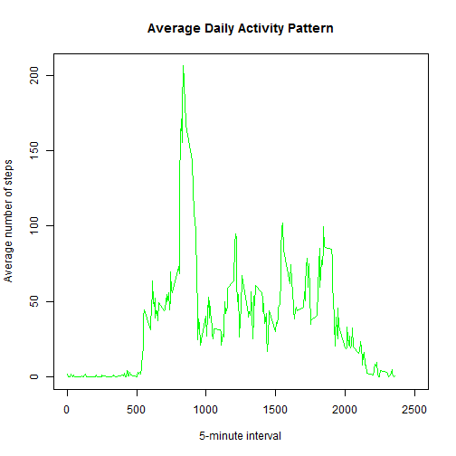
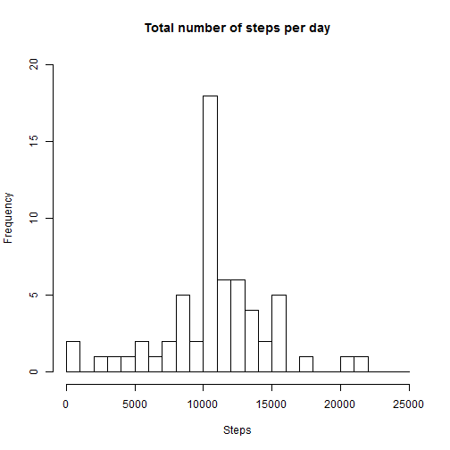
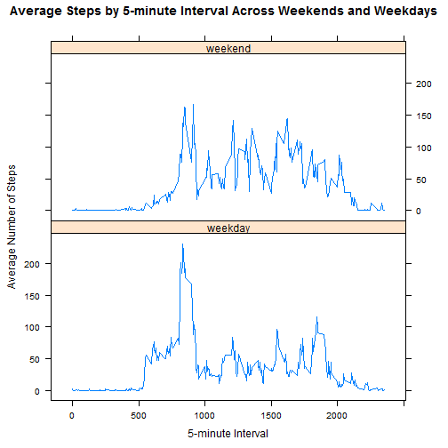

# Reproducible Research: Peer Assessment 1

Please see assignment instructions [here](https://class.coursera.org/repdata-012/human_grading/view/courses/973513/assessments/3/submissions/)

## Loading and preprocessing the data
The zipped data file is taken from the forked repository (see instructions above) and de-compressed into RStudio working directory.

1. Loading  the data:

```r
activity <- read.csv('activity.csv', header = TRUE, sep = ",", colClasses=c("numeric", "character", "numeric"))
```
2. Processing the data into a format suitable for the analysis:

```r
# Converting date variable 
activity$date <- as.Date(activity$date, format = "%Y-%m-%d")
```

## What is mean total number of steps taken per day?
1. Calculate the total number of steps taken per day

```r
# Missing values are ignored for this part of the assignment as per instructions
stepsByDay <- aggregate(steps ~ date, activity, sum)
colnames(stepsByDay) <- c("date","steps")
```
2. Make a histogram of the total number of steps taken each day

```r
hist(stepsByDay$steps, breaks=seq(from=0, to=25000, by=1000), 
     xlab="Steps", main="Total number of steps per day")
```

 

3. Calculate and report the mean and median of the total number of steps taken per day

```r
stepsMean   <- mean(stepsByDay$steps)
stepsMedian <- median(stepsByDay$steps)
cat("Mean of the total number of steps per day:", as.character(stepsMean))
```

```
## Mean of the total number of steps per day: 10766.1886792453
```

```r
cat("Median of the total number of steps per day:", as.character(stepsMedian))
```

```
## Median of the total number of steps per day: 10765
```

## What is the average daily activity pattern?
1. Make a time series plot of the 5-minute interval (x-axis) and the average number of steps taken, averaged across all days (y-axis)

```r
stepsByInterval <- aggregate(steps ~ interval, activity, mean)
names(stepsByInterval) <- c("interval", "steps")
plot(stepsByInterval$interval, stepsByInterval$steps, type="l", col="green", xlim=range(0:2500), 
     xlab="5-minute interval", ylab="Average number of steps", main="Average Daily Activity Pattern")
```

 

2. Which 5-minute interval, on average across all the days in the dataset, contains the maximum number of steps?

```r
# Maximum number of steps is rounded when reporting
maxValues <- stepsByInterval[which.max(stepsByInterval$steps),]
cat("Interval", as.character(maxValues$interval), 
    "contains the maximm number of steps:", as.character(round(maxValues$steps)))
```

```
## Interval 835 contains the maximm number of steps: 206
```

## Imputing missing values

1. Calculate and report the total number of missing values in the dataset

```r
totalNA <- sum(is.na(activity$steps))
cat("Total number of missing vaues:", as.character(totalNA))
```

```
## Total number of missing vaues: 2304
```
2. Devise a strategy for filling in all of the missing values in the dataset

*Took advice to use the mean for each 5-minute interval to replace missing values with the average value of  that time interval calculated in the previous part.*

3. Create a new dataset that is equal to the original dataset but with the missing data filled in.

```r
activityNoNA <- activity
for (i in 1:nrow(activityNoNA)) {
    if (is.na(activityNoNA[i, ]$steps)) {
       activityNoNA[i,]$steps<-stepsByInterval[stepsByInterval$interval==activityNoNA[i,]$interval,]$steps
    }
}
```
4. Make a histogram of the total number of steps taken each day and Calculate and report the mean and median total number of steps taken per day. Do these values differ from the estimates from the first part of the assignment? What is the impact of imputing missing data on the estimates of the total daily number of steps?

```r
# Preparing dataset for histogram: 
stepsByDayNoNA <- aggregate(steps ~ date, activityNoNA, sum)
colnames(stepsByDayNoNA) <- c("date","steps")
hist(stepsByDayNoNA$steps, breaks=seq(from=0, to=25000, by=1000), ylim=range(0:20), 
     xlab="Steps", main="Total number of steps per day")
```

 

```r
#  Calculating and reporting the mean and the median for a new dataset where missing values are filled in:
stepsMeanNoNA <- mean(stepsByDayNoNA$steps)
stepsMedianNoNA <- median(stepsByDayNoNA$steps)
cat("Mean of the total number of steps per day calculated on imputed dataset:", as.character(stepsMeanNoNA))
```

```
## Mean of the total number of steps per day calculated on imputed dataset: 10766.1886792453
```

```r
cat("Median of the total number of steps per day calculated on imputed dataset:", as.character(stepsMedianNoNA))
```

```
## Median of the total number of steps per day calculated on imputed dataset: 10766.1886792453
```
*The mean of the total number of steps calculated on a new dataset is the same as in the first part of the assignment since I chose strategy to replace missing values with the mean for that interval.*

*The median of the total number of steps calculated on a new dataset has become the mean of the total number of steps since I used mean values for the replacement of missing values.*

## Are there differences in activity patterns between weekdays and weekends?
1. Create a new factor variable in the dataset with two levels - "weekday" and "weekend" indicating whether a given date is a weekday or weekend day

```r
activityByDaytype <- activityNoNA
# creating a new variable 'daytype' by using weekdays() function which sets it as TRUE if it's a weekend and FALSE if it's a weekday
activityByDaytype$daytype <- weekdays(as.Date(activityNoNA$date)) %in% c("Saturday","Sunday")
# making it a factor with two levels
activityByDaytype$daytype <- ifelse(activityByDaytype$daytype, "weekend", "weekday")
```
2. Make a panel plot containing a time series plot (i.e. type = "l") of the 5-minute interval (x-axis) and the average number of steps taken, averaged across all weekday days or weekend days (y-axis). 

```r
# Since the panel plot was requested, using lattice plotting system
library("lattice")
stepsByDaytype <- aggregate(steps ~ interval + daytype, activityByDaytype, mean)
xyplot(steps ~ interval | daytype, stepsByDaytype, type = "l", layout = c(1,2), xlab = "5-minute Interval", ylab = "Average Number of Steps", main = "Average Steps by 5-minute Interval Across Weekends and Weekdays")
```

 

*Yes there are differences in activity patterns between weekdays and weekends: on a weekdays activity is highest in the mornings and then at least twice as low throughout the day, whereas on a weekends it is more evenly spreaded out with slightly higher activity in the mornings.*
